# 체인코드 배포하기

지금까지 블록체인 네트워크를 구축했고, 지금부터는 그 위에서 실행되는 프로그램을 만들 차례입니다. Chaincode는 블록체인 위에서 돌아가는 코드 입니다. Chaincode에서는 데이터 유형을 정의하고, 트랜잭션을 어떻게 실행할지에 대한 로직을 정의하고, 실행되는 조건을 검증하게 됩니다. Chaincode는 응용 프로그램에서 실행하는 트랜잭션을 통해 원장 상태를 초기화 하고 관리합니다. 또한 일반적으로 네트워크 구성원이 동의한 비즈니스 로직을 처리하므로 "Smart Contract" 이라고도 합니다.

이 Lab에서 사용하는 Chaincode는 golang (GO) 으로 작성 되었으며, 미리 준비된 carTrace.zip를 이용하여 Deploy를 수행하게 됩니다.

[carTrace.go.zip 다운로드](https://github.com/OracleCloudKr/OracleBlockchain_Workshop2/raw/master/CarDealerLab/artifacts/carTrace.go.zip)

## A. Founder에 체인코드 인스톨 & 초기화 

체인 코드를 설치하려면 Founder Org의 콘솔에서 **Chaincodes**탭으로 이동 한 다음 **Deploy a New Chaincode** 버튼을 클릭하십시오. 여기에서 로컬 컴퓨터에서 가져 오거나, 자동화 된 빌드 프로세스의 마지막 단계인 Rmote URL을 참조하여 체인 코드를 업로드 할 수 있습니다.

체인 코드를 설치하는 데는 두 가지 옵션이 있습니다. 한 번 클릭으로 체인 코드를 설정하고 여러 가지 기본값을 포함하도록 설계된 **Quick Deploy** 또는 체인 코드 설정 프로세스에 대한 보다 세부적인 제어를 위한 고급 옵션이 있습니다.

이 Lab에서는 **고급 옵션**을 사용하여 프로세스를 단계별로 수행하고 각 설정의 의미를 설명하도록 하겠습니다. 대부분의 개발 시나리오에서 빠른 배포로 하시면 됩니다.

체인 코드 배포의 첫 번째 단계에서는 연관된 peer 각각에 체인 코드를 설치합니다. 이를 위해 chaincode 이름 (이 Lab에서는 **carTrace**), 버전 (**v1**) 그리고 어느 피어에 배포 할 것 인지를 입력 할 수 있습니다. 이 경우 모든 peer에게 배포 할 예정이지만, Transaction을 검증하는 peer와 Ledger 사본을 단순히 저장하는 peer가 있습니다. (참고: 빠른 배포 모드에서는 모든 peer에게 배포됩니다).

    주의 : 체인 코드가 설치된 모든 Org에서 유일하게 유지되므로 체인 코드 이름에 주의하십시오.

1. 첫 번째 화면은 다음과 같이 나오게 됩니다.

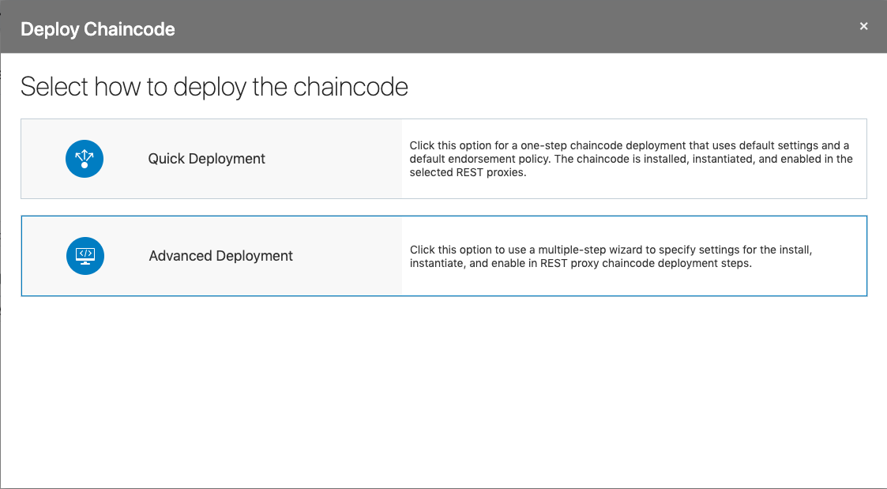

2. > Chaincode Name : **carTrace**  
   > Version : **v1**  
   > Target Peers : peer0, peer1 
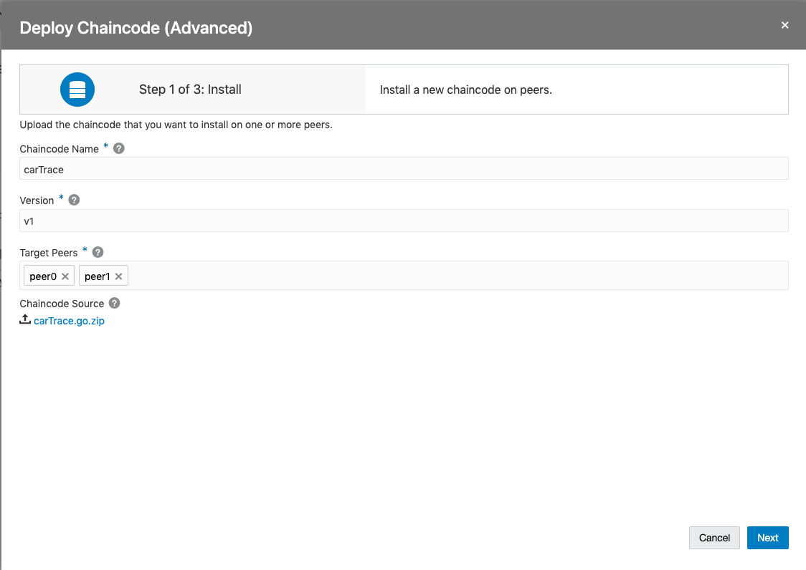
3. 체인 코드를 Peer에 설치하려면 **Next**를 클릭하십시오. 
    
4. 성공 메시지가 나오게 되면, 체인 코드를 '인스턴스화'하라는 메시지가 나타나게 되는데, 이 단계는 체인 코드를 채널에 넣는 단계입니다.  
이 단계에서 다음을 수행해야 합니다.

* 체인 코드를 인스턴스화 할 채널을 선택하십시오.
* 채널에 참여할 로컬 Peer를 선택하십시오.
* 보통은 기본 endorse 정책이 적절할 수도 있지만, 여기서는 Transaction이 2 개의 조직 중에서 2 개가 서명해야 하는 정책을 선택합니다.
* **initial parameter 변수는 기본값으로 남겨 둡니다.** 이 특정 체인 코드는 매개 변수를 요구하거나 사용하지 않으며 일시적인 맵이 필요 없습니다.
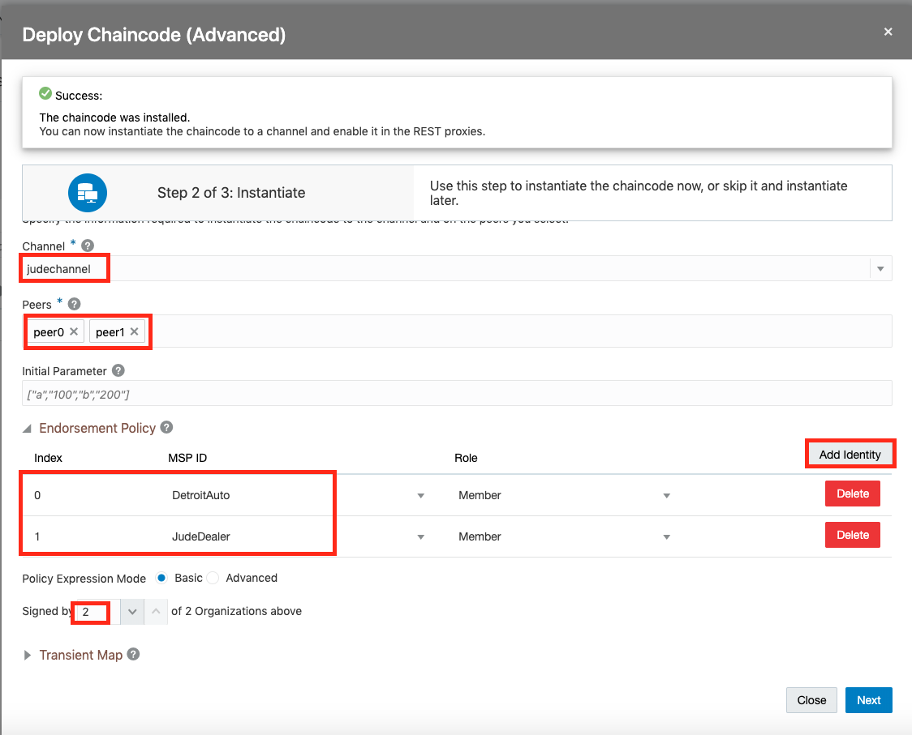

~~~
[Endorsement Policy]
Endorsement(검증) 를 어느 Org, 어느 peer에서 할 것인지를 선택하는 과정입니다. 
여기에서 MSP가 DetroitAuto와 JudeDealer로 선택을 하게 되면, 두 개의 Org에서 모두 검증(endorse)를 하게 됩니다. 
이 검증을 수행할 때 Siged by 2 of 2 Organizations above 는 2개의 Org중 2개가 검증에 통과하면 성공을 의미한다고 하는 설정입니다.|
~~~
       
5. 다음 단계는 이 체인코드를 노출시킬 Rest Proxy를 선택하는 단계입니다. Oracle Blochchain Cloud Platform에는 현재 4개의 proxy를 제공하고 있으며, 이 중에서 복수개를 선택을 해서 노출 시킬 수 있습니다. 이 Lab에서는 restproxy1 만 선택해서 진행하도록 하겠습니다. 그리고 어떤 peer들을 restproxy에 노출시킬 지를 선택합니다.
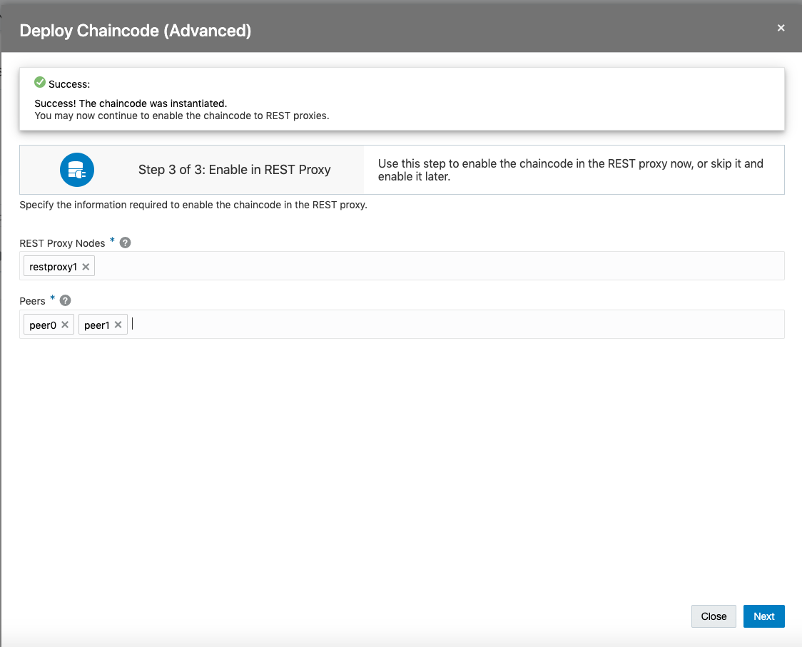

6. 그리고 **다음**을 클릭하십시오. 이 과정은 다소 시간이 걸립니다.
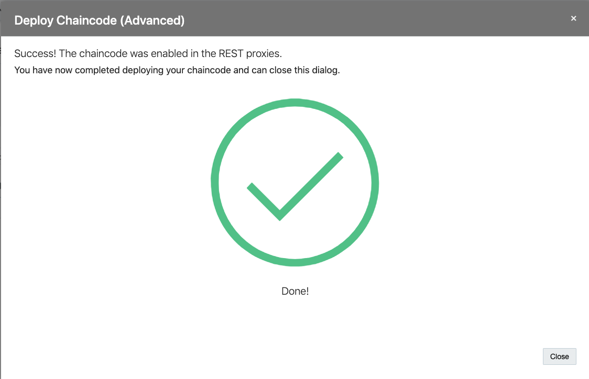
체인 코드는 이제 설정되었고, Founder 인 Detroit Auto의 **JudeChannel**에서 실행됩니다. 

7. 두 번째 채널인 **SamChannel**에서도 이 체인 코드를 실행하려면 수동으로 인스턴스화 해야 합니다. 이렇게 하려면 설치된 carTrace를 확장하고 설치된 버전 (v1)에 대한 햄버거 메뉴를 클릭 한 다음 **Instantiate**를 선택하십시오.
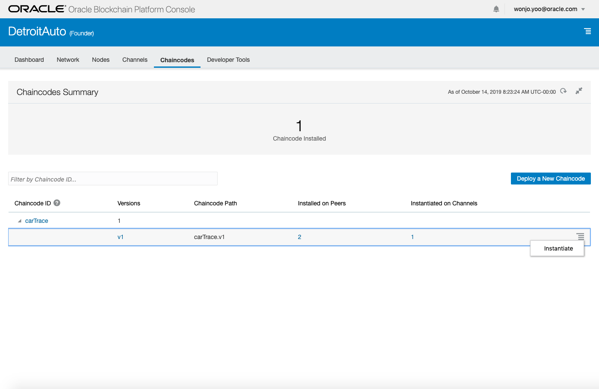

8. 이 화면에서 두 번째 채널을 선택하고 두 피어를 추가 한 다음 이전과 같이 endorsement 정책을 구성합니다.

9. **인스턴스화(Instantiate)** 를 클릭하십시오. 이 과정은 다소 시간이 걸릴 수 있습니다.

10. JudeChannel에 Deploy를 할 때는 Rest Proxy를 선택했습니다만, SamChannel에서는 이 과정을 Nodes 탭에서 개별로 설정해야 합니다. Nodes 탭으로 이동해서 restproxy1의 오른쪽 아이콘을 선택하고 Edit Configuration을 클릭합니다.

11. 기존에는 judechannel만 생성이 되어 있는 것을 확인하 실 수 있습니다. + 버튼을 눌러서 samchannel을 추가로 선택합니다. carTrace와 peer0, peer1을 선택한 후 Submit 버튼을 누르면 rest proxy에 samchannel에 배포되어 있는 체인코드가 노출이 되게 됩니다.

## B. Participant에 체인코드 인스톨과 초기화 
   
1. Participant의 각 콘솔에서 **Chaincodes** 탭으로 이동하십시오. 
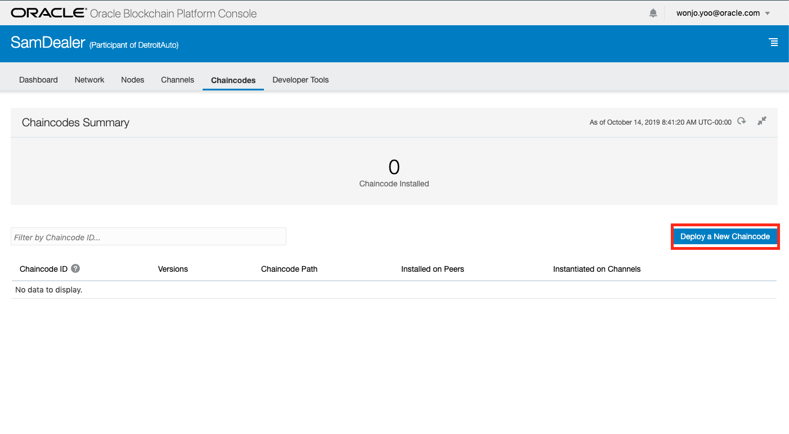

2. 체인 코드를 배포 할 때 체인 코드가 이미 Founder에 의해 채널에서 인스턴스화 되었으므로 Peer에 체인 코드만 설치하면 됩니다. 이렇게 하려면 체인 코드 배포의 **Advanced** 모드에서 하셔야 합니다.
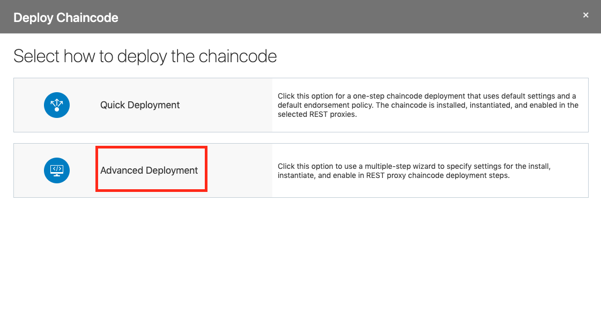

3. **Install Chaincode** 단계에서 동일한 체인 코드 zip 파일을 업로드하십시오. 
 체인 코드의 이름과 버전이 Founder 에서 제공 한 이름과 동일하고 이 Org의 Peer 각각이 "Target Peers" 선택 항목에 포함되어 있는지 확인하십시오. Next 버튼을 누릅니다.
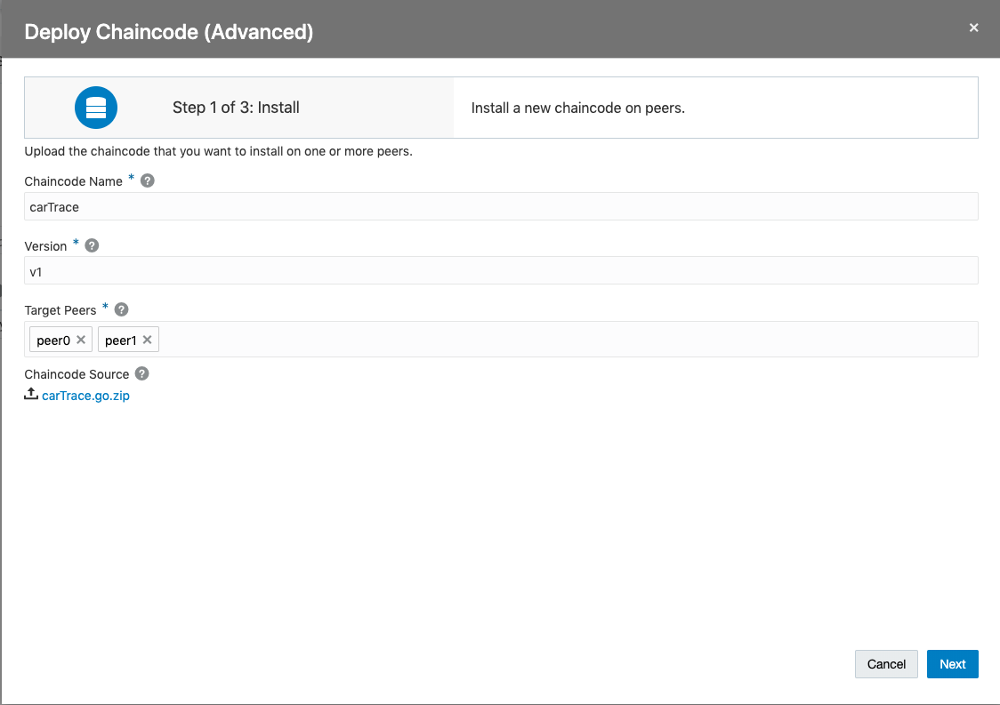

4. 인스턴스화는 Org 나 peer가 아닌 채널에 종속되기 때문에, 일단 체인 코드가 설치되면 인스턴스화 할 필요가 없습니다.  
**Close** 버튼을 눌러 체인 코드 인스턴스화 단계에서 취소하십시오. 
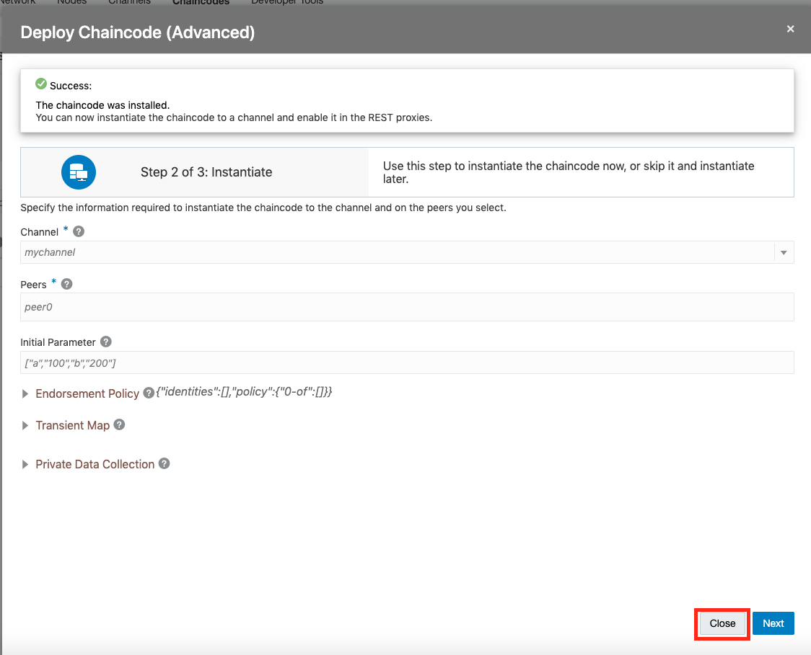

5. 체인 코드 이름 옆에 있는 작은 화살표를 클릭하여 체인 코드 항목을 확장하고 이미 인스턴스화 된 채널이 있음을 확인할 수 있습니다. 1의 숫자가 보이지 않고 0으로 보일 경우 오른쪽 상단의 Refresh 버튼을 누릅니다.
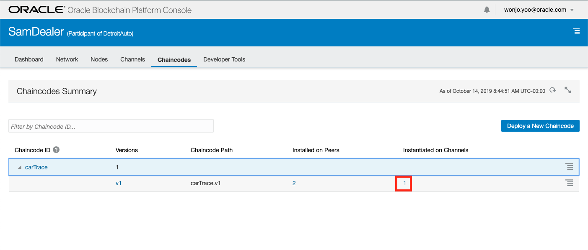

## C. JudeDealer 에 대해서도 동일하게 체인코드를 deploy 합니다. 
1. 위 Deploy 과정을 JudeDealer 콘솔에서 동일하게 수행합니다.
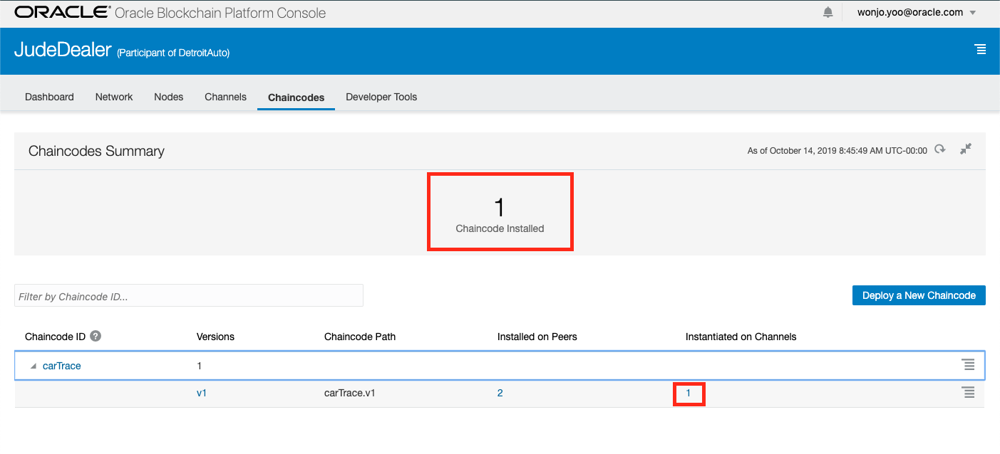

1. Client에서 호출을 할때는 REST Proxy를 통해서 호출을 하게 되게 되는데, Proxy에서 각 peer로 Balancing을 하게 됩니다. 이때 여기에 등록이 되어 있지 않게 되면 request를 보내지 못하게 되므로 방금전에 추가해준 다른 Org의 peer들도 Rest Proxy에 등록을 하는 과정을 수행해야 합니다.

## D. Participant의 peer에 배포된 정보를 다시 Founder에 추가하기
이전 Lab에서 채널에 추가된 Participant의 peer들의 정보를  Founder에 보내는 작업을 했습니다. 하지만, Participant의 peer가 위에서 배포한 chaincode를 갖고 있는지에 대한 정보를 Founder에 다시 갱신해 줘야 합니다. 그래야 Endorsing 과정에서 다른 peer들에게 chaincode의 검증을 요청할 수 있게 됩니다.

1. Participant Org에서 **Nodes** 탭으로 이동 한 다음 **Export / Import** 버튼을 클릭하여 노드 정보를 내보냅니다.
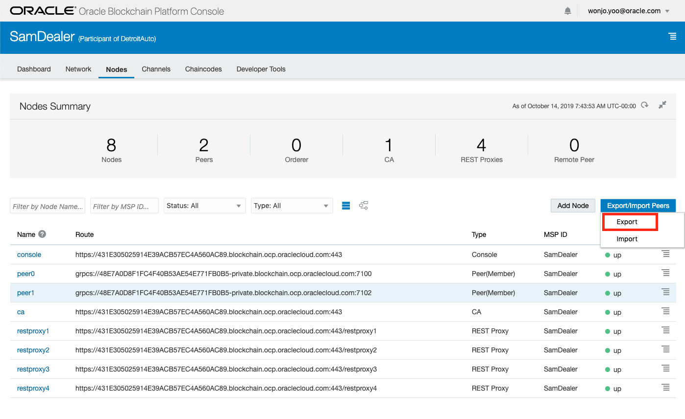

2. Participant의 Peer(peer0,peer1)를 선택한 다음 **Export**를 클릭하고 결과 파일을 저장합니다.

3. **Founder(DetroitAuto)** 화면의 **Node** 탭에서 **Export / Import** 버튼과 **Import** 옵션을 통해 Peer정보를 가져옵니다.

4. SamDealer-exported-nodes.json 을 선택해서 열기 버튼을 누릅니다. Import 버튼을 누릅니다.

1. JudeDealer에 대해서도 동일하게 반복 수행합니다. JudeDealer 콘솔->Nodes 탭을 선택하고 Export/Import Peers를 클릭한 후 Export 를 선택합니다.

6. **Founder(DetroitAuto)** 화면의 **Node** 탭에서 **Export / Import** 버튼과 **Import** 옵션을 통해 Peer정보를 가져옵니다. JudeDealer-exported-nodes.json를 선택합니다.
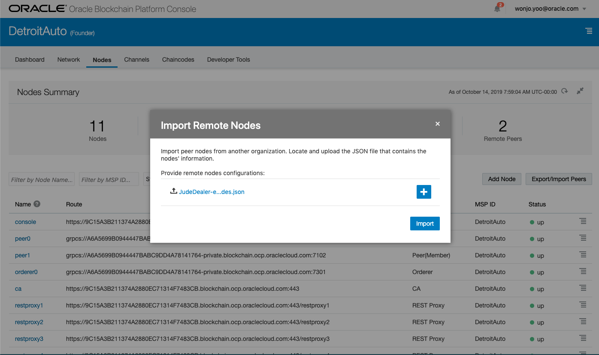

## E. Rest Proxy에 Participant의 peer 등록하기
1. DetroitAuto의 Nodes탭에서 Restproxy1의 edit configuration을 선택하십시오.

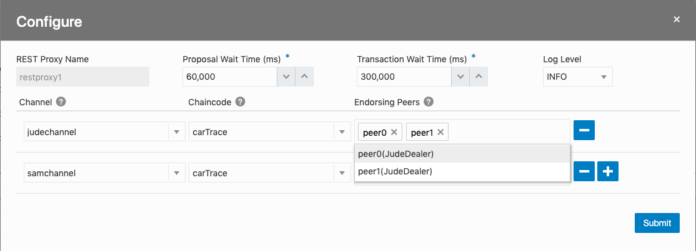

1. judechannel에는 JudeDealer의 peer들을 추가하고, samchannel에는 SamDealer들의 peer들을 추가합니다. 
여기에서 추가를 하게 되면 chaincode호출시에 Detroit Auto의 rest proxy를 통해서 각 peer들에게 요청이 들어갈 수 있게 됩니다.

---

[이전 Lab으로 이동](README.md)
