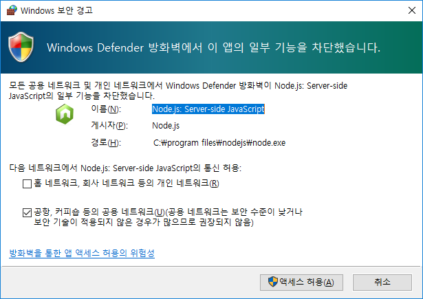
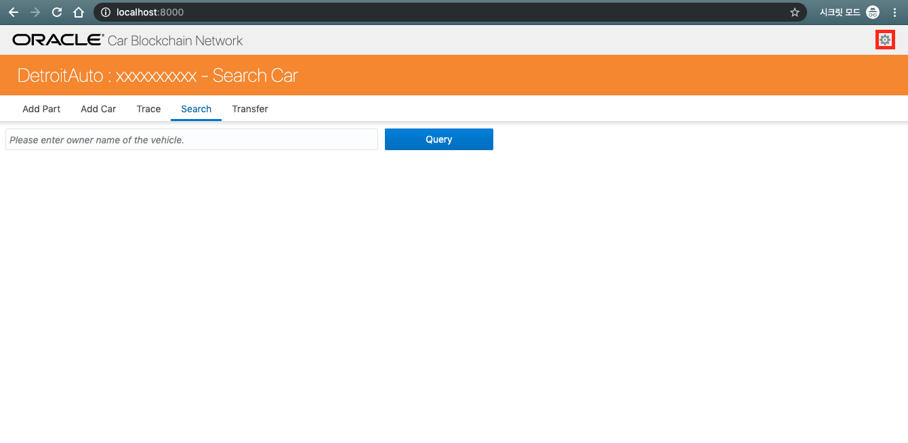
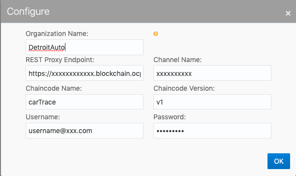
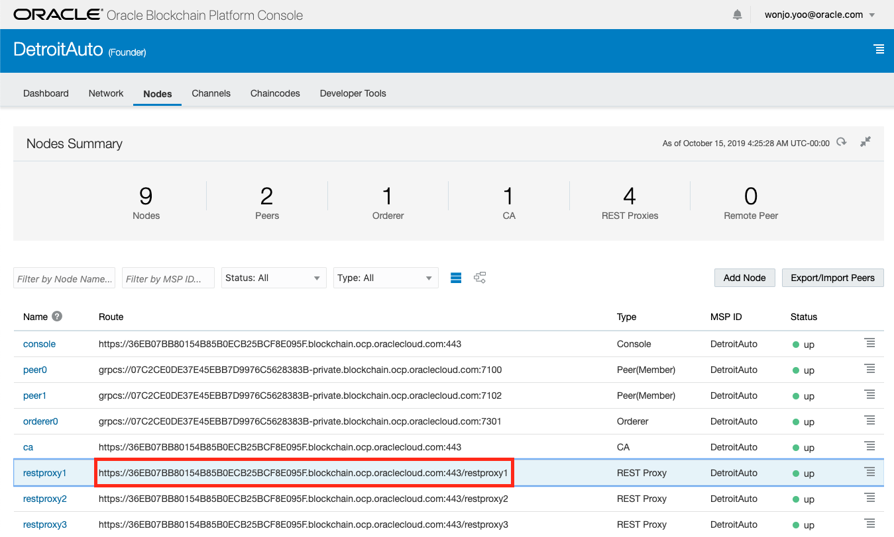
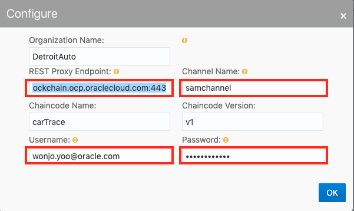

# Client용 Web Application 준비하기
이 Lab은 제조사와 Dealer에서 사용하는 Application을 준비하는 과정입니다. 자동차의 부품과 자동차에 대한 정보와 소유권은 체인코드를 통해 Blockchain Platform에 저장이 되게 됩니다. 이 체인코드는 SDK를 사용하거나 REST API를 통해서 호출할 수 있습니다. 여기서는 node.js용 application을 통해서 호출하게 됩니다. 먼저 node.js를 설치한 후에 web application을 실행해보도록 하겠습니다.

### 1. 로컬에 node.js 설치하기
먼저 https://nodejs.org/ko/download/ 에서 node.js를 로컬 컴퓨터에 다운로드 받은 후 실행해서 설치하시기 바랍니다.

### 2. 준비된 web application 다운로드 하기
node.js 용 web application ([다운로드](https://github.com/OracleCloudKr/OracleBlockchain_Workshop2/raw/master/CarDealerLab/artifacts/auto_webapp.zip))

### 3. 실행하기
1) 압축을 푼 후 auto_webapp/bin 디렉토리로 이동한 후 run을 (윈도우는:run.cmd, 맥은 터미널에서 run.sh)를 실행합니다.
윈도우의 경우 방화벽 오픈을 위해 다음과 같은 메세지가 나오게 되는데 이때 액세스 허용을 눌러 줍니다.

2) 화면에서 다음과 같이 나오게 되면 8000 포트로 web application이 정상적으로 Listen하며 서비스가 되게 됩니다. 
PORT: 8000, PROTOCOL: http

3) 이제 브라우저를 열고 해당 포트로 접속해 봅니다.
http://localhost:8000/

4) 오른쪽 상단의 동그라미 설정 버튼을 눌러 환경설정 화면으로 이동합니다.

1) 여기에서 REST Proxy Endpoint는 DetroitAuto에서 제공하는 REST Proxy의 주소를 입력해야 합니다.

1) 먼저 REST API의 주소를 확인하기 위해 DetroitAuto의 Console로 이동해서 Nodes 탭을 선택한 후 restproxy1의 주소를 복사합니다. 여기서 restproxy1은 제외하고 복사합니다.

1) REST Proxy주소를 위에서 복사한 주소로 붙여 넣습니다. 이때 뒤에 공백이 들어가지 않도록 주의합니다. 
    - REST Proxy Endpoint : REST API 주소입니다. 이 정보는 Founder Console(DetroitAuto) 에서 확인할 수 있습니다. 
      - (Oracle Blockchain Cloud Service의 경우: `https://62C57E2D8944EBB48B1E6C5A28A461.blockchain.ocp.oraclecloud.com:443`)
      - 주의: 위 주소에서 /restproxy1은 제외해야 합니다.
    - Channel Name : 접속하고자 하는 채널 이름입니다. (예: **samchannel**, **judechannel**) 
    - UserName : oracle cloud 접속 아이디 
    - Password : 패스워드
 - channel 이름은 samchannel로 설정해서 먼저 확인을 해보겠습니다.  
 

이제 Application을 확인할 준비가 되었습니다.
---
[이전 Lab으로 이동](README.md)