# Web App에서 BlockChain 호출하기

## A. Blockchain Query하기

### 1. 애플리케이션에 접속합니다.

1) 앞에서 준비한 Application의 console을 클릭해서 App을 엽니다.
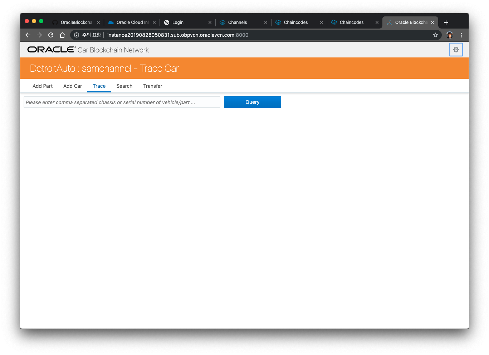

    이 App은 제조업체인 Detroit와 파트너 업체인 Sam Dealer, Jude Dealer에서 사용하는 Vehicle Trace Dashboard 입니다. 이 App은 각각 Org의 Chaincode에 접근해서 해당 채널에 배포된 Ledger로 부터 Query를 해오고, 다른 업체로 부품을 전달하는 Transaction을 수행할 수 있는 기능을 제공합니다.
  
   딜러들은 거래를 제조업체와 공유하는 비공개 채널로 푸시합니다. "carTrace"이라는 Smart Contract(체인코드)에 의해 실행됩니다. 이 Smart Contract은 컨소시엄의 허가된 원장에 대한 모든 상태를 관할합니다. 해당 대리점의 "차량 추적 대시 보드"를 열고 포함된 부품 및 차량을 쿼리 할 때 사용하십시오.

   이 Application의 호출 구조는 다음과 같습니다.

        Node.js App --> Rest URL (DetroitAuto) --> peer의 Chaincode

2. Application Tab 설명
   1. Add Part : 부품 입력
   2. Add Car : 차량 입력
   3. Trace : 부품/차량 거래(Trace) 정보 조회
   4. Search : 차량 소유자로 조회
   5. Transfer : 부품/차량의 소유자 이전
   
### 2. 블록체인에 접속하기 위한 설정을 합니다.

3) 다음과 같이 현재 설정된 채널이 samchannel 인 것을 알 수 있습니다.
    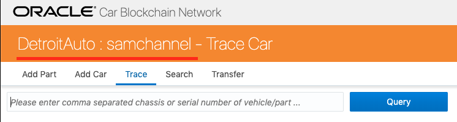

1) Add Car, Add Part 탭에서 부품을 추가하거나 차량을 추가해서 다양한 테스트를 수행해 봅니다. 
DetroitAuto에서 Airbag 부품(Part) 를 추가하고 SamDealer로 부품을 옮기는 Transaction 을 수행해보도록 하겠습니다.
먼저 Add Part에서 airtbag 부품을 하나 입력해봅니다. 일련번호를 1111 이라고 입력하겠습니다.
    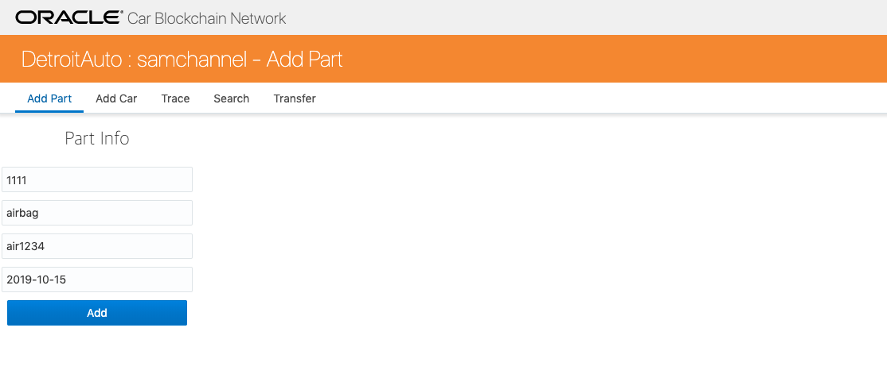
2) 정상적으로 입력이 되면, Trace탭에서 조회를 할 수 있습니다. 일련번호 1111을 입력한 후 Query버튼을 누릅니다.  해당 내역이 조회가 되고 오른쪽에 json형태로 반환이 되는 것을 확인할 수 있습니다. 이 부분은 해당 key값을 갖고 있는 entity의 모든 변경 내역을 조회해서 json형태로 반환해주는 chaincode의 API를 호출한 결과입니다.
    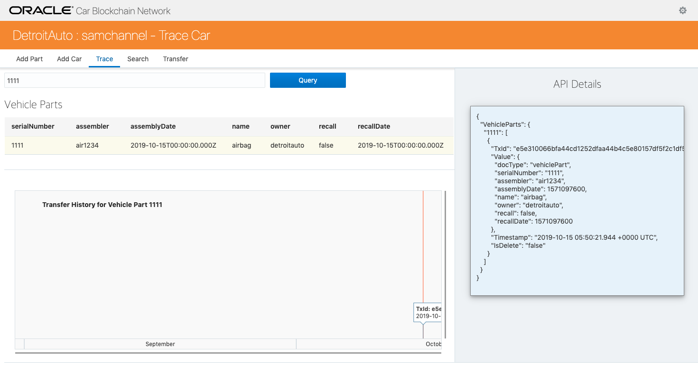

1) 이번에는 차량을 등록해 보도록 하겠습니다. car1234라는 일련번호를 입력하고, 제조사(manufacturer)에 DetroitAuto를 입력합니다. 나머지도 아래 그림과 동일하게 입력한 후 Add버튼을 누릅니다.
    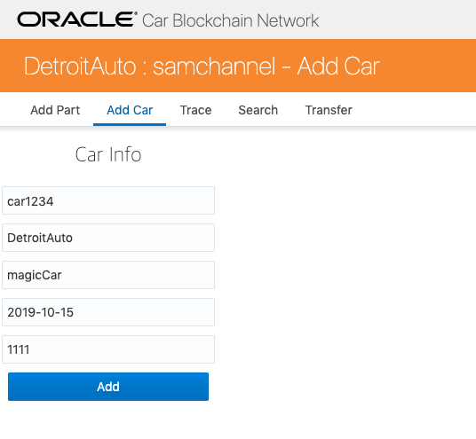

1) 정상적으로 입력이 되면 Trace에서 내역을 확인할 수 있는데, 현재는 소유주(owner)가 DetroitAuto(제조사)에 있는 것을 확인할 수 있습니다.
    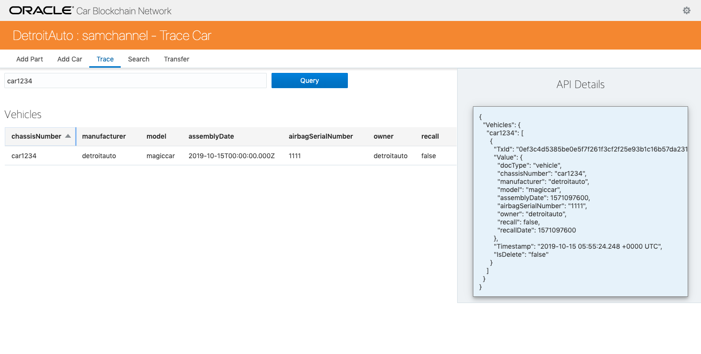

1) Search 탭에서는 소유주(owner) 이름으로 조회할 수 있습니다.
    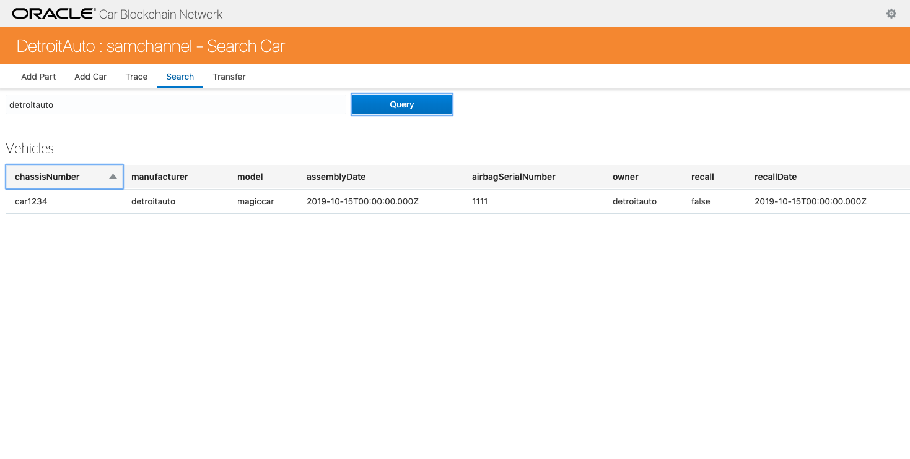

1) Transfer 탭에서 SamDealer로 소유주를 옮겨 보겠습니다. App내에서 DetroitAuto로 Login을 하기 위해 Company name을 detroitauto로 입력하고 비밀번호는 아무거나 입력한 후 Login버튼을 누릅니다.
    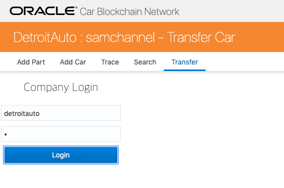

1) chassis number of a vehicle 에 앞에서 생성한 차량번호 car1234를 입력하고 vehicle new owner에 SamDealer를 입력 한 후에 Transfer vehicle 버튼을 클릭합니다.
    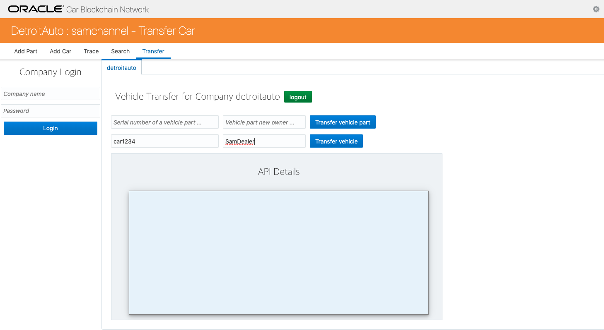
1) Chaincode의 returnCode로 정상 메세지인 Success가 반환된 것을 확인할 수 있습니다. Transaction ID로 같이 반환됩니다.
    
2) Trace탭에서 모든 내역들이 조회되는지 확인해보겠습니다. car1234를 입력하고 Query를 조회합니다. 이번에는 2개의 데이터가 조회된 것을 확인할 수 있습니다. 오른쪽에도 json형태로 두개의 transaction history가 모두 조회가 됩니다. 이처럼 blockchain에 데이터가 들어가게 되면 update를 하게 되더라도 모든 Transaction 내역은 남아 있고 삭제가 불가능하게 됩니다.
    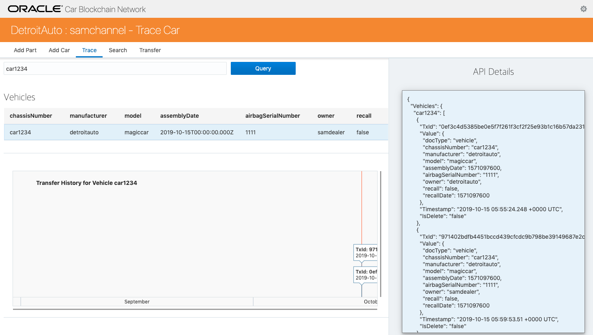

### 4. Jude Dealer의 채널로 접근합니다.

1) 화면 상단 우측의 아이콘을 클릭하여 Jude 가 사용하는 채널로 설정합니다.
    - Org Name은 변경하지 않습니다.
    - REST Proxy Endpoint : 변경하지 않습니다.
    - Channel Name : **judechannel**
    
    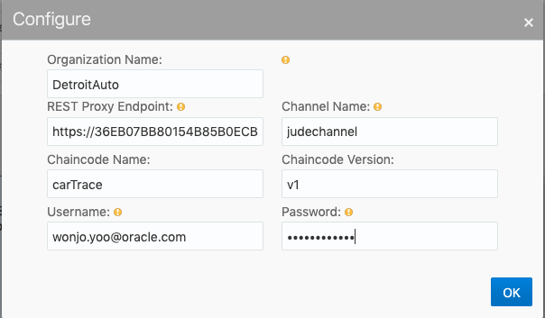

2) 다음과 같이 제목이 judechannel 로 바뀌었음을 알 수 있습니다. 여기에서 samchannel에서 입력한 car1234를 조회해보면 각 채널별로 chaincode의 데이터에 접근하는 것이 분리되어 있기 때문에 조회가 되지 않습니다. 
    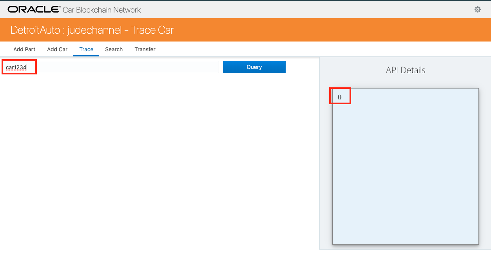
---
## C. REST API를 통해 Transaction 실행 - 옵션
**아래 Lab은 시간이 되시는 경우 확인해 보시면 좋습니다.**

CarTrace의 모든 트랜잭션은 REST API로 호출할 수 있습니다.
REST 호출을 실행할 때 두 가지 옵션이 있습니다.
- Postman과 같은 Tool 사용 : ([다운로드](https://www.getpostman.com/apps))
- 터미널에서 "curl" 명령 사용 (Windows에서는 curl 다운로드 필요 https://curl.haxx.se/download.html)

([PostMan환경파일](https://raw.githubusercontent.com/OracleCloudKr/OracleBlockchain_Workshop2/master/CarDealerLab/artifacts/OBP_WORKSHOP_ENV.postman_environment.json))

([PostMan collection](https://raw.githubusercontent.com/OracleCloudKr/OracleBlockchain_Workshop2/master/CarDealerLab/artifacts/OBP_Workshop.postman_collection.json))

위 파일을 Download 한 후 Postman에 import를 하시면 Query를 위한 샘플용 request가 들어 있습니다.

1. 왼쪽 request들 가장 아래 부분에 Query Vehicle 이라는 request를 선택하십시오.
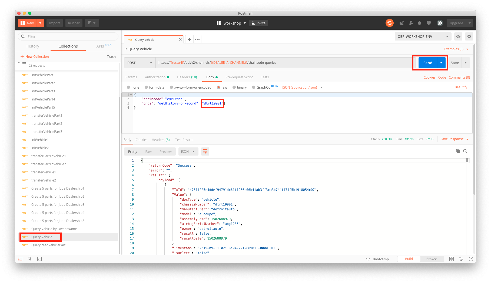

1. 오른쪽 입력파라미터 중 args로 위에서 사용한 차량번호 **car1234**를 입력합니다.
    send를 누르면 결과가 차량 history에 대한 결과가 json 형태로 반환됩니다.

    위 결과는 curl 명령어를 사용해도 동일한 결과를 얻을 수 있습니다.

---
<b>수고하셨습니다. 모든 Lab 과정을 끝내셨습니다.</b>

[이전 Lab으로 이동](README.md)