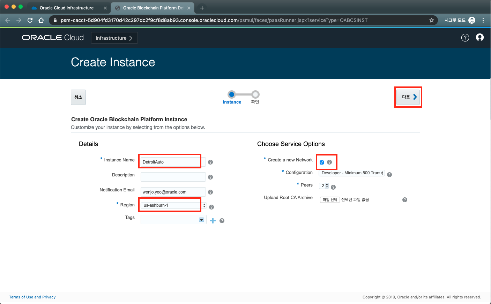
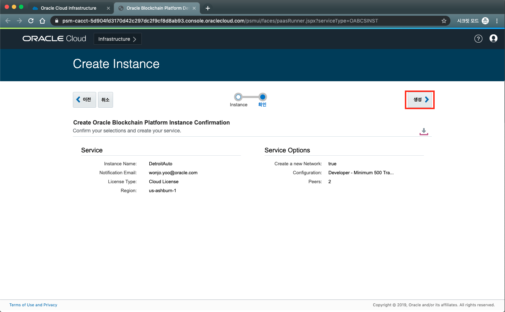
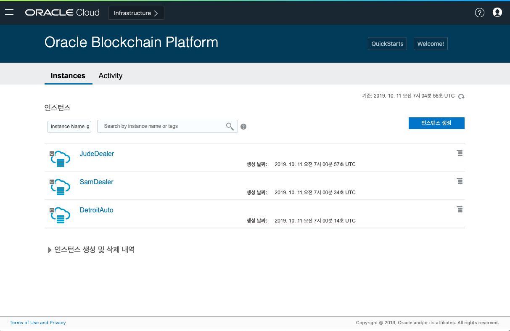

# 오라클 블록체인 인스턴스 생성하기
이 단계에서는 3개의 블록체인 인스턴스를 생성할 예정입니다. Founder 인스턴스 1개와 Participant 인스턴스 2개를 생성하게 됩니다. 인스턴스의 Role은 Founder와 Participant 두가지로 선택이 가능합니다. Founder는 블록체인 네트워크의 중심이 되는 인스턴스로 다른 여러 Participant 인스턴스를 관리할 수 있게 됩니다.

먼저 Oracle Cloud Console에서 블록체인 플랫폼 서비스로 이동합니다.
1. Oracle Cloud에 접속한 후 좌측 상단에 있는 메뉴 버튼을 누른 후 왼쪽 메뉴중에서 '플랫폼 서비스'를 선택 한 후 Blockchain Platform 메뉴를 클릭합니다. 만약 이 메뉴가 보이지 않을 경우 해당 cloud account 의 관리자 계정으로 접속하거나 권한을 별도로 부여 받아야 합니다.
   
   

2. 블록체인 플랫폼 콘솔에 처음 접속을 한 경우에는 아래와 같이 나오게 됩니다.  
오른쪽에 있는 인스턴스 생성 버튼을 누릅니다.

3. 이 Lab에서 사용할 블록체인 인스턴스를 만들도록 하겠습니다. 인스턴스 이름을 DetroitAuto로 입력합니다. Founder로 선택해서 인스턴스를 만들겠습니다. Region은 us-ashburn-1 로 선택하겠습니다.
'다음' 버튼을 누릅니다.

4. 생성 버튼을 누릅니다.

5. 정상적으로 요청이 전달이 되면 인스턴스 생성이 시작됩니다. 인스턴스 생성까지는 수분 정도 소요가 되게 됩니다.

6. 이 Lab에서는 3개의 인스턴스를 필요로 하기 때문에 바로 다음 인스턴스들을 생성하도록 하겠습니다. 다시 인스턴스 생성 버튼을 누릅니다.

7. 이번에는 SamDealer라는 이름으로 생성하도록 하겠습니다. 주의할 점은 이 인스턴스는 Founder가 아니라 해당 네트워크에 참가하는 Participant로 생성을 하도록 하겠습니다. 'Create a new Network'를 체크 해제 합니다. Region은 'us-ashuburn-1'로 선택합니다.

1. SamDealer를 생성하고 바로 JudeDealer라는 이름으로 Participant로 생성합니다. 위와 동일하게 'Create a new Network'를 체크 해제 합니다. Region은 'us-ashuburn-1'로 선택합니다.

2. 인스턴스 생성은 5분 정도 소요됩니다. 

---
[이전 Lab으로 이동](../README.md)
