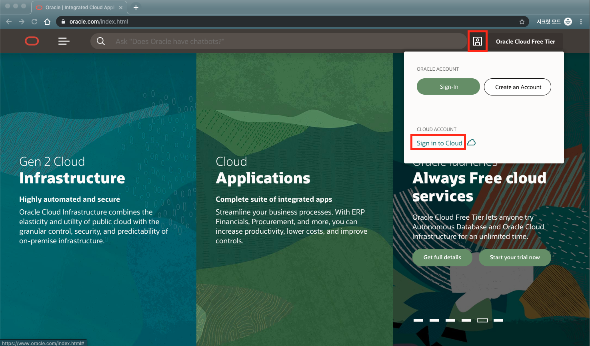
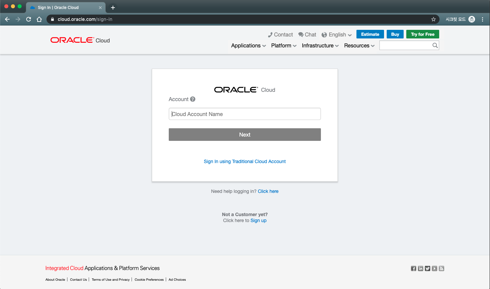

# 오라클 클라우드에 로그인하기
먼저 갖고 계신 오라클 클라우드 계정을 통해 오라클에 로그인 합니다.
1. oracle cloud에 로그인
   http://oracle.com/ 에 접속 후 상단의 메뉴에서 Sign in to Cloud 클릭

2. account 의 이름을 입력합니다.

3. 계정과 비밀번호를 입력합니다.

---
[이전 Lab으로 이동](../README.md)
